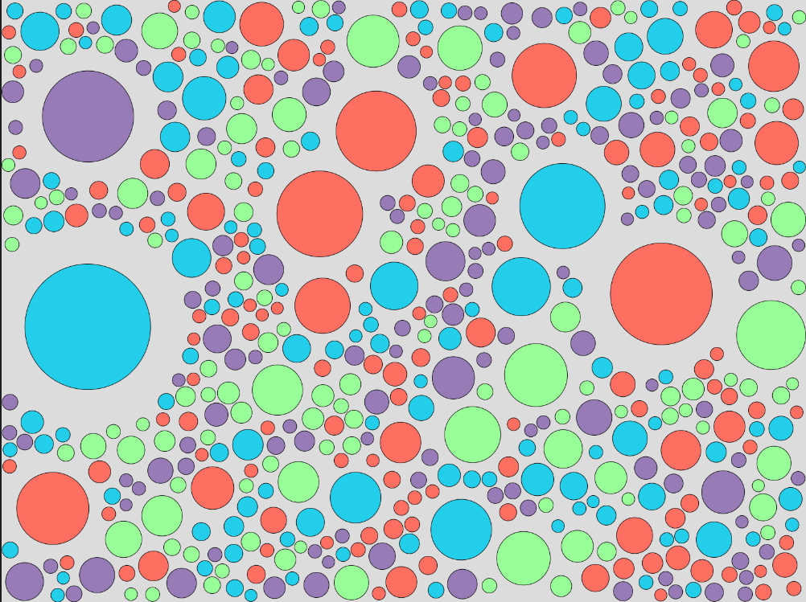
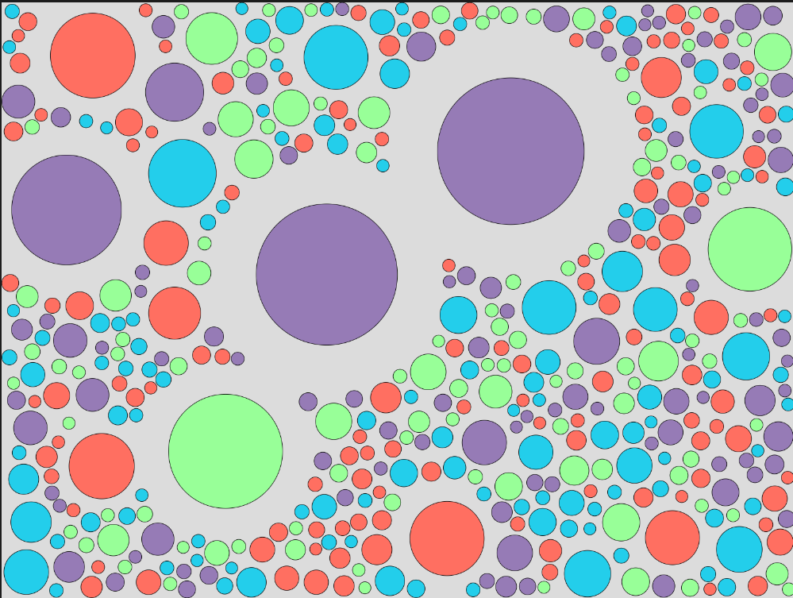
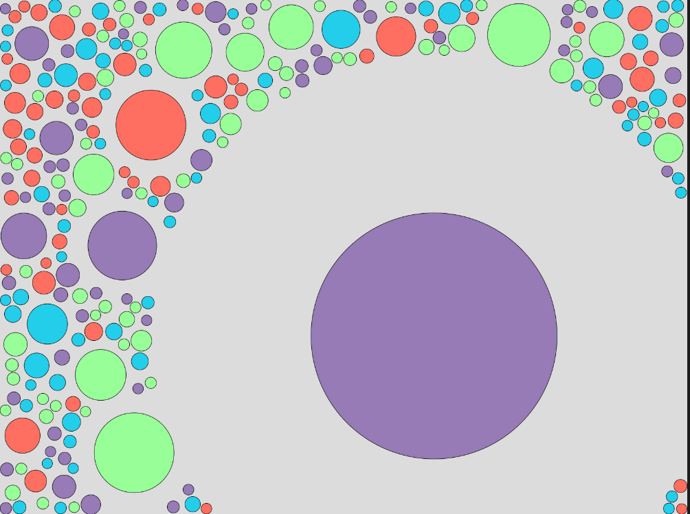

# Moving Circles

A p5.js program that generates procedurally animated circles using Pareto distribution, featuring collision detection and movement for creating beautiful artwork.

## Overview

This project explores random variables through visual simulation. Circles are generated with sizes following a Pareto distribution, then animate across the canvas with collision detection, resulting in organic, ever-changing visual patterns.

## Features

- **Pareto Distribution**: Circle sizes follow a Pareto distribution for realistic, power-law behavior
- **Collision Detection**: Circles detect and interact with each other
- **Movement**: Animated motion creates dynamic visual evolution
- **Procedural Art**: Emergent patterns generated through mathematical principles

## Gallery

