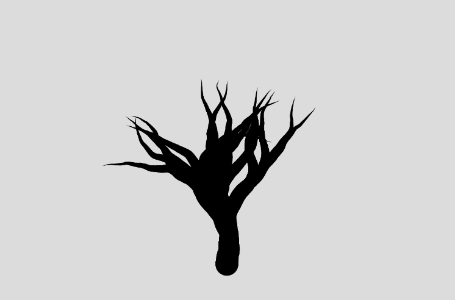
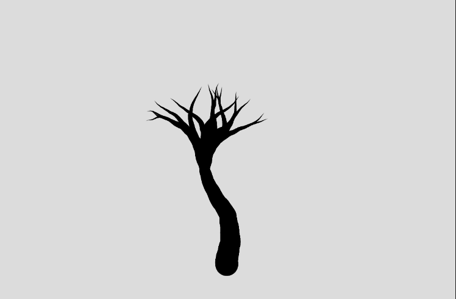
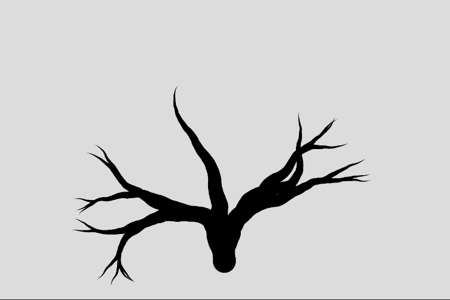
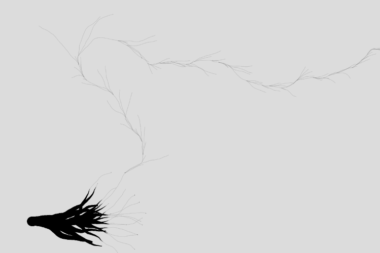
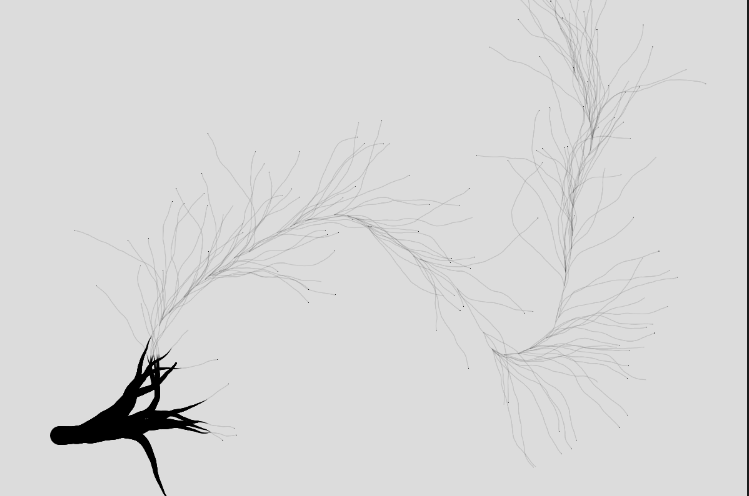

# Procedural Tree Generation

A p5.js program that generates realistic trees using procedural algorithms and mathematical distributions.

## Overview

This program creates natural-looking trees through procedural generation techniques. It leverages **normal distribution** to create smooth, organic variations in branch angles and density, while implementing progressive branch width reduction for visual realism.

## Features

- **Normal Distribution for Angles**: Branch angles vary smoothly using normal distribution, creating natural-looking asymmetry
- **Dynamic Branch Generation**: Branch count is determined probabilistically using normal distribution
- **Realistic Width Scaling**: Branch width decreases progressively, just like natural tree structure
- **Procedural Design**: Fully algorithmic generation allows for unique trees on each run

## Gallery

## Some Bugs

